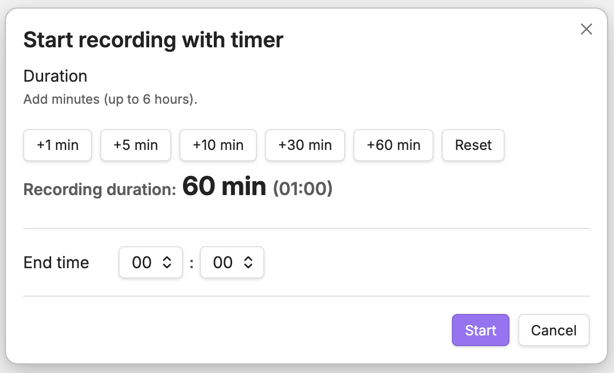

# Audio Recording Timer

Start Obsidian’s core audio recording with a countdown duration or an end time, and stop it automatically when time is up.

## Usage

- Click the plugin’s microphone icon in the left ribbon.
- Choose a duration (quick add buttons) or an end time (dropdowns).
- Click **Start**.

While recording:

- Click the plugin’s microphone icon again to **stop now** or **extend**.
- Remaining time is shown in the status bar (desktop).

## Requirements

- Obsidian core plugin **Audio recorder** must be enabled.

By default, this plugin uses:

- Start: `audio-recorder:start`
- Stop: `audio-recorder:stop`

You can change them in **Settings → Audio Recording Timer** if needed.

## Notes

- To “unify” the UI, you can hide the core recorder’s ribbon icon from Obsidian (right-click the ribbon icon and hide it).
- Auto-stop uses best-effort timing. If the OS suspends Obsidian (e.g., sleep), the stop is executed immediately after the app resumes.

## Disclosures

- No payment or account required.
- No network use.
- No ads or telemetry.
- Uses your device microphone via Obsidian’s core **Audio recorder** plugin. Recorded files are created by Obsidian inside your vault according to your attachment settings.

## Development

This repo can auto-deploy the built files into your vault’s plugins folder after each successful build.

1. Copy `.env.example` to `.env` and set `OBSIDIAN_PLUGINS_DIR`.
2. Run `npm run dev` (watch) or `npm run build` (production).
